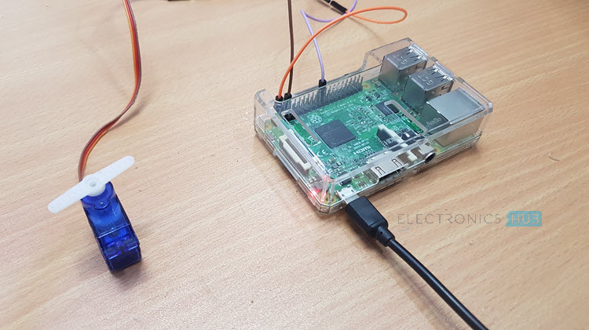
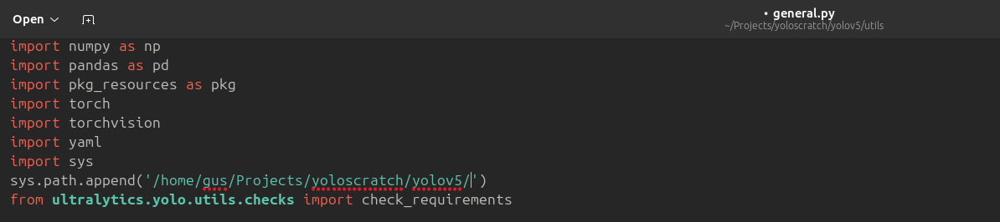

# Webcam-based Object Tracking and Servo Control with Raspberry Pi Using Yolov5 and Deepsort

This GitHub project aims to provide a solution for real-time object tracking using YOLO (You Only Look Once) and DeepSORT (Deep Simple Online and Realtime Tracking) algorithms, along with servo motor control. The project utilizes a webcam connected to a laptop to capture video frames, and the object center for each frame is obtained using the YOLO and DeepSORT models.

The system is designed to track objects within the video and adjust the position of a servo motor accordingly. When the object center falls below a certain threshold width of the video frame, the servo motor is instructed to turn towards the side where the object center is located. This ensures that the camera follows the object's movement in the X-axis.

To facilitate communication between the laptop and a Raspberry Pi, the project establishes a TCP connection. The object center coordinates and tracking information, which are printed in the terminal for each frame, are passed to the Raspberry Pi through this TCP connection. The Raspberry Pi uses this information to control the servo motor's movement.

The main goal of this project is to create a reliable and efficient object tracking system that can be easily deployed using readily available hardware components. The implementation utilizes YOLO and DeepSORT for accurate object tracking, and the integration with a Raspberry Pi enables seamless servo motor control based on the object's position within the video frame.

The project's GitHub repository provides all the necessary code and instructions to set up and run the system successfully. By following the provided guidelines, users can replicate the project, customize it for their specific needs, or contribute to its further development.

Projeccts Directory contains PPT and Report For this project

```
conda create -n yolo 
conda install pip
git clone https://github.com/ultralytics/yolov5.git
git clone git@github.com:ZQPei/deep_sort_pytorch.git
pip install requirements.txt
```


Then

To run a Local video file(mp4) from your laptop run this

```
python main.py --input_path vid.mp4 
false
```

To Run with a Webcam connected to your laptop use this command :

```
python main.py --cam 0 --display
false
```

To Run with a Webacm Connected and a Servo motor connected to Raspberry pi

```
python main.py --cam 0 --display
true  
```

The false and true represents wheather a server should be created and wait for it to connect or run it locally , This true false are supposed to be inputed when prommpted after running the command

### Connecting Raspberry pi


As show in thhis figure connect servo to ground and 5v pin , Then connect third wire to GPIO 12

After Connection Mount the webcam in top of servo somehow , (i used glue to do that)



After mounting it ssh into RPI and run raspberry.pi in that (Found in Raspberry folder)

Also Dont forget to configure Your IP address in Raspberry.py code , modify to your  ip address to (pc/laptop)'s IP to work

###### For Video Demonstration Click the links

Rec of Terminal : https://drive.google.com/file/d/1He1Sid1Sjdw4EiIUV-5Gm93-Sa19vAZ4/view?usp=sharing

Rec of cam Output : https://drive.google.com/file/d/1yRdWD6bFGTYnJ7pkVsjb_Z53n0OITtM-/view?usp=sharing

Demonstration : https://drive.google.com/file/d/1KSYmSC0ZEHMDUvMusLUT-oesXhfjWl3i/view?usp=sharing

# Common Pitfalls

if yolo version is less than 6 yolov5 <6.0

### Pitfalls [yolov5 v<6.0]

<aside>
💡 git clone [https://github.com/ultralytics/yolov5.git](https://github.com/ultralytics/yolov5.git)
pip install -r requirements.txt
pip install numpy==1.20

will get this error : “AttributeError: 'Upsample' object has no attribute 'recompute_scale_factor’”

to solve go to
/home/gus/anaconda3/envs/yolov/lib/python3.8/site-packages/torch/nn/modules/upsample.py

in this file

</aside>

```python
def forward(self, input: Tensor) -> Tensor:
    return F.interpolate(input, self.size, self.scale_factor, self.mode, self.align_corners,
                         #recompute_scale_factor=self.recompute_scale_factor
                         )
```

You are good to go

If you don't want to make changes to your Conda environment, you can also modify a single line in the YOLO code.That is open yolov5/models/yolo.py

in that in forward_once function add this before x=m(x)

```python
m.recompute_scale_factor = None
```

### Pitfalls [yolov5 v=6.0]

if you git clone and try to run it gives error . Here are the corrections for yolov5 version v6.0

replace this in [main.py](http://main.py) first 4 lines

```python
from yolov5.utils.general import (
    check_img_size, non_max_suppression, scale_boxes, xyxy2xywh)
from yolov5.utils.torch_utils import select_device, time_sync
from yolov5.utils.dataloaders import letterbox
```

change time_synchronized() to time_sync()

change this in _forward once of yolo.py

```python
if isinstance(m, nn.Upsample):
                m.recompute_scale_factor = None
```

This is how it should look like

```python
def _forward_once(self, x, profile=False, visualize=False):
        y, dt = [], []  # outputs
        for m in self.model:
            if m.f != -1:  # if not from previous layer
                x = y[m.f] if isinstance(m.f, int) else [x if j == -1 else y[j] for j in m.f]  # from earlier layers
                m.recompute_scale_factor = None
            if profile:
                self._profile_one_layer(m, x, dt)
            if isinstance(m, nn.Upsample):
                m.recompute_scale_factor = None  
            x = m(x)  # run
            y.append(x if m.i in self.save else None)  # save output
            if visualize:
                feature_visualization(x, m.type, m.i, save_dir=visualize)
        return x
```

Add this in [general.py](http://general.py) of yolov5/utils  so that u wont get import error (utils.TryExcept) not found

```python
import sys
sys.path.append('/home/gus/yoloscratch/yolov5/')
from ultralytics.yolo.utils.checks import check_requirements
```

```python
pip install easydict
```

Some work 😎 for you wherever np.float or [np.int](http://np.int) error comes manually change it :( np.int to int and np.float to np.float64

Common Pitfall :

Dont take weights from previous version and run from that . It will fail and give anchor error found extra  dimesnion.

Take weights from here or from yolo docs and run to get correctly.

When Downloading change [general.py](http://general.py) from yolov5/utils



Add your path correctly here according to your directory.
